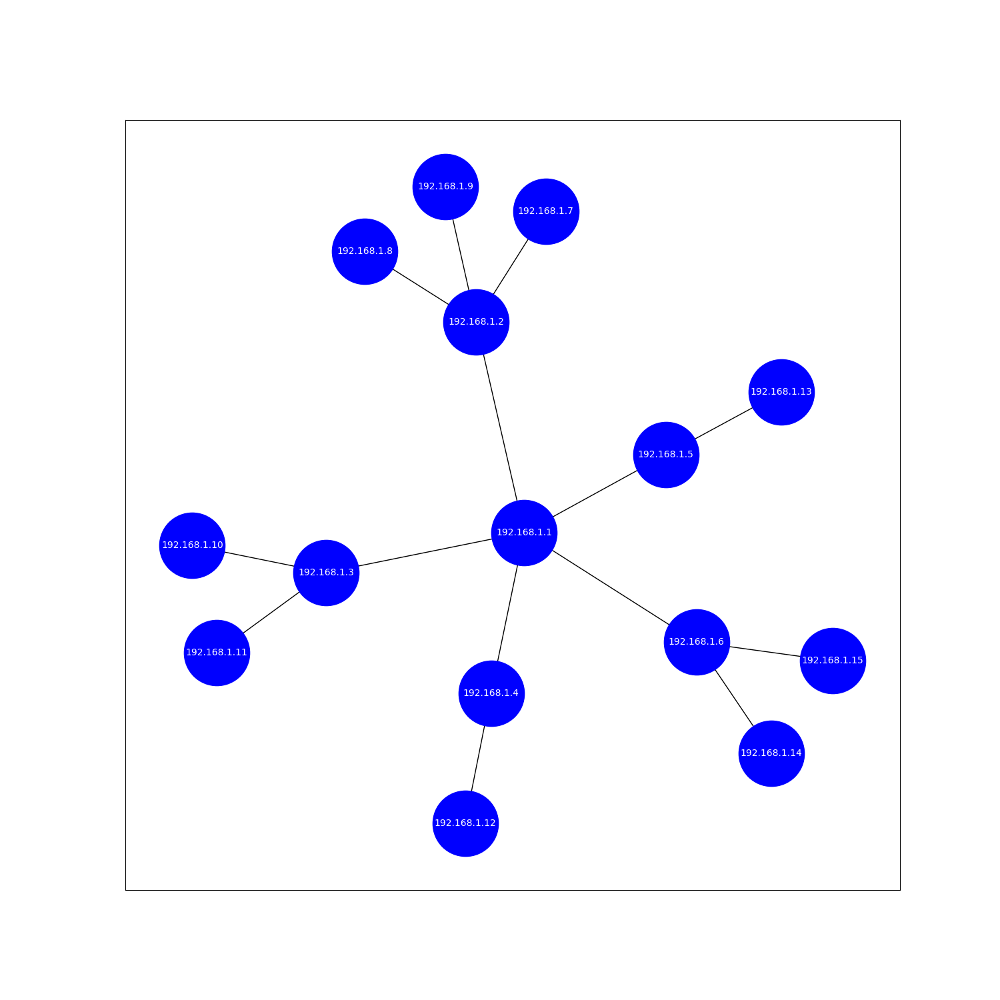

# goit-algo-hw-06

Відображенний граф іллюструє локальну мережу невеликого офісу

## Результати роботи алгоритмів обходу дерев:
Результати пошуку BFS:

- 192.168.1.**1** 
- 192.168.1.**2**
- 192.168.1.**3**
- 192.168.1.**4**
- 192.168.1.**5**
- 192.168.1.**6**
- 192.168.1.**8**
- 192.168.1.**9**
- 192.168.1.**7**
- 192.168.1.**10** 
- 192.168.1.**11** 
- 192.168.1.**12** 
- 192.168.1.**13** 
- 192.168.1.**14** 
- 192.168.1.**15** 

Такий порядок обходу дерева відповідає порядку обходу в ширину, тобто спочатку обробляються всі вузли на одному рівні, потім переходять на наступний рівень.

Результати пошуку DFS:

- 192.168.1.**1** 
- 192.168.1.**2** 
- 192.168.1.**7** 
- 192.168.1.**8** 
- 192.168.1.**9** 
- 192.168.1.**3** 
- 192.168.1.**10** 
- 192.168.1.**11** 
- 192.168.1.**4** 
- 192.168.1.**12** 
- 192.168.1.**5** 
- 192.168.1.**13**
- 192.168.1.**6** 
- 192.168.1.**14** 
- 192.168.1.**15** 

Такий порядок обходу дерева відповідає порядку обходу в глибину, тобто спочатку обробляється вузол, потім переходить на наступний рівень, доки не дійде до кінця гілки, після чого повертається на один рівень вище і обробляє іншу гілку.